# qtviz

**Declarative, native-Qt plotting for data-intensive desktop apps.**

Describe a plot once as immutable data, then render it through whichever engine
fits the moment — **pyqtgraph** (fast, OpenGL, interactive), **matplotlib**
(publication-quality, vector export), or **webengine** (interactive Plotly in an
embedded browser view). The same `Element` draws identically on all three, swaps
backends at runtime, and drops into any PySide6 application as a plain `QWidget`.


```python
import numpy as np
from PySide6.QtWidgets import QApplication
import qtviz as qv

app = QApplication([])
x = np.linspace(0, 10, 500)

view = qv.View(qv.Scatter({"x": x, "y": np.sin(x)}, x="x", y="y"))
view.show()
app.exec()
```

<p align="center">
  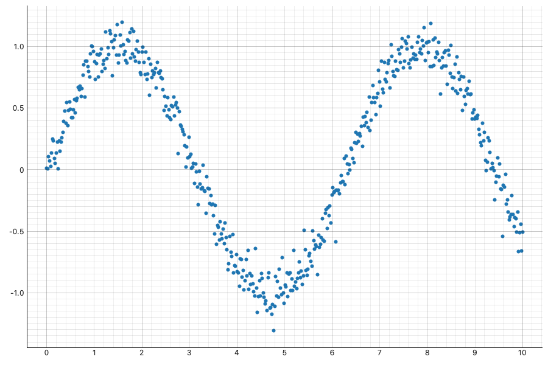
</p>

That is a complete program: a real Qt window, an OpenGL-accelerated scatter, pan
and zoom out of the box. Change one keyword — `backend="matplotlib"` or
`backend="webengine"` — and the same line renders through a different engine.

> **Status — `1.0` stable + the parity program.** The public surface is frozen
> and policy-backed ([docs/stability.md](docs/stability.md)); everything since is
> additive ([`design/parity-program.md`](design/parity-program.md), [D83]–[D95]):
> **27 elements** across three backends, first-class axes (log/symlog,
> **calendar-time axes**, **twin y axes**, tick formatting, explicit/minor
> ticks — with data-space events everywhere), legends, raster norms
> (log/power/symlog/boundary with honest colorbars),
> statistical/annotation/composition vocabularies (meshes, vector fields,
> stems, mosaic layouts), screen-cost rendering for huge zarr/dask/xarray
> grids, live streaming sources with in-place updates, and brush-selection
> through datashaded views — **760+ passing tests**, mypy-clean, 92%
> coverage. Private by design; install
> from source / `git+`.

---

## In action

| | |
|---|---|
| 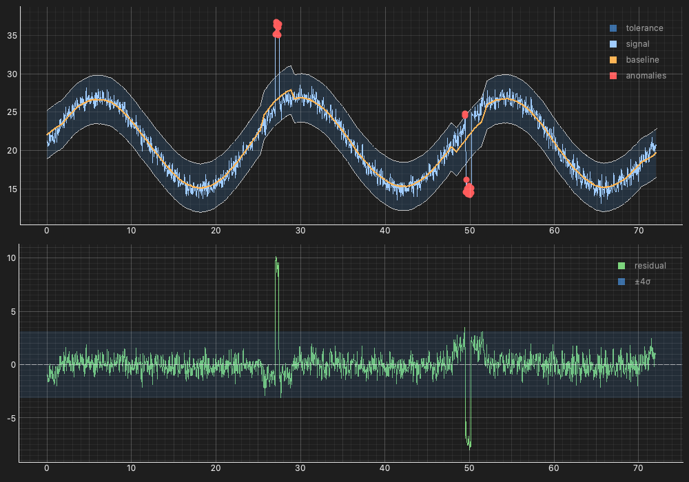 *Telemetry monitoring — rolling baseline, 3σ band, flagged anomalies, X-linked residual panel ([`examples/26`](examples/26_telemetry_monitoring.py))* | 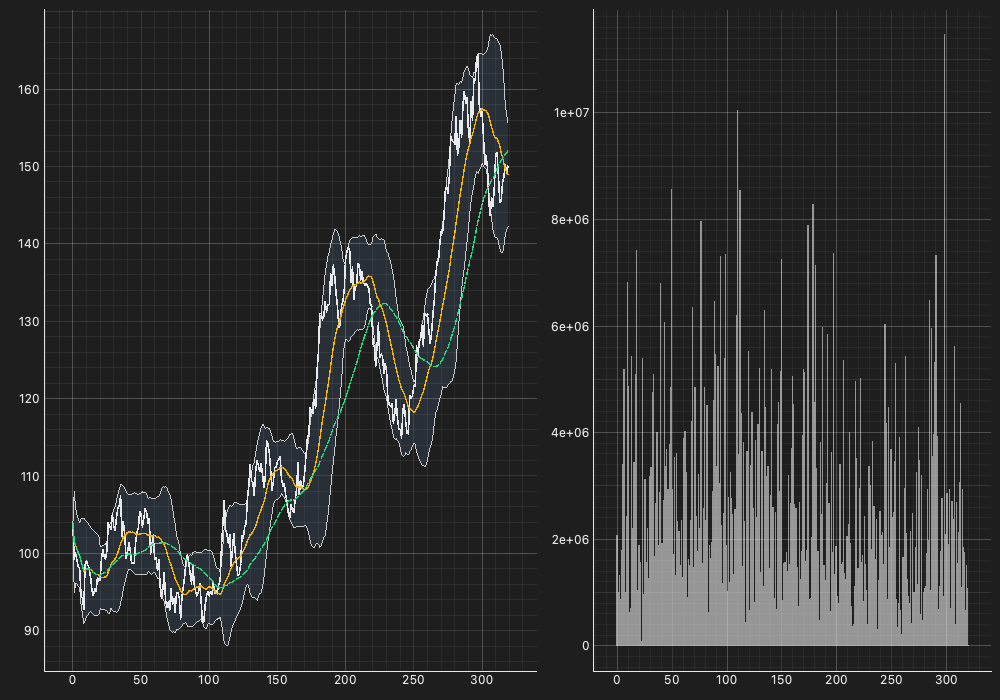 *Market analytics — price + moving averages + Bollinger `Spread` over linked volume `Bars` ([`examples/27`](examples/27_market_analytics.py))* |
| 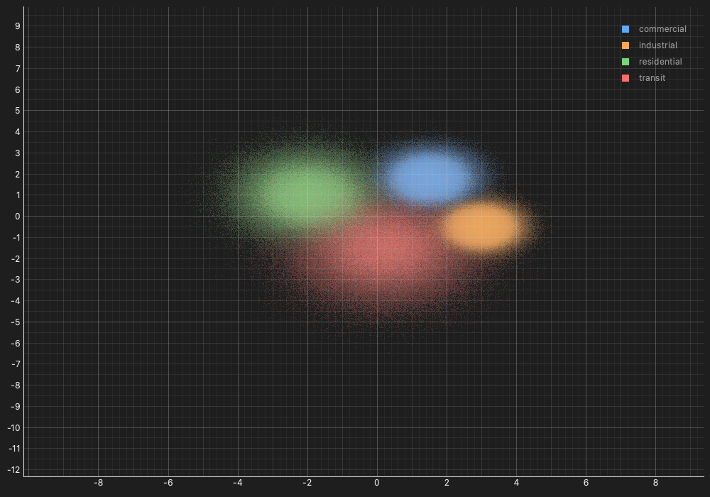 *2M events → a Datashaded categorical density map; hover reports the count under the cursor ([`examples/28`](examples/28_event_density_map.py))* | 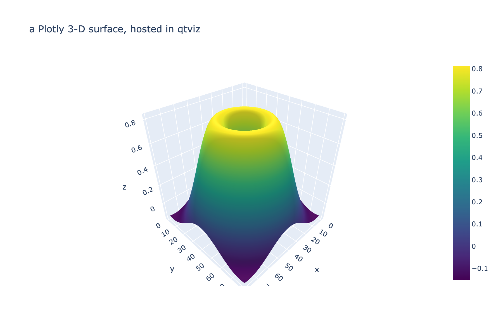 *A Plotly 3-D surface hosted via `RawFigure` — events still arrive as typed qtviz events ([`examples/18`](examples/18_webengine_raw_figure.py))* |


*The everyday figures of the popular libraries, declaratively — step + markers,
stacked `Area`, horizontal grouped `Bars`, a `Pie` donut, `Ecdf`, filled
`Contour`, SI tick formatting, a dual-axis pair, a `Quiver` field with a
reference key, a `Mesh` with discrete boundary levels, a `Stem` series, and an
annotated `Heatmap` with computed label contrast, with the native toolbar
([`examples/35_everyday_figures.py`](examples/35_everyday_figures.py))*

All screenshots are captured straight from the runnable scripts in
[`examples/`](examples) — regenerate them with
`uv run python tools/capture_screenshots.py`.

## Why qtviz?

Most Python plotting either targets the browser (Plotly, Bokeh, HoloViz) or gives
you one rendering engine bolted into Qt (matplotlib's `FigureCanvas`, raw
pyqtgraph). qtviz takes a different position:

- **One immutable API, many backends.** An `Element` is pure, value-hashed data —
  it says *what* to plot, never *how*. Write `Scatter(table, x="t", y="v")` once
  and render it native, publication-grade, or web. Pick per view, swap at runtime,
  or mix backends in a single window.
- **Native Qt, not a web app in disguise.** The default backends are real
  `QWidget`s with Qt signals/slots and strict GUI-thread discipline — no browser,
  no JavaScript bridge, no server. They feel like the desktop because they are the
  desktop.
- **Runs 100% offline.** No network at render time, ever — a hard requirement, not a
  default you can flip. The native backends draw in-process; the webengine backend
  bundles its JavaScript locally (from the installed `plotly`/`bokeh` packages, never
  a CDN). Built for air-gapped and firewalled environments.
- **Engineered for large data.** The data layer is container-agnostic and
  lazy-first — dict / NumPy / pandas / Arrow eagerly, **Dask / xarray / zarr**
  out-of-core — and integrates **Datashader** so 10M+ points become a
  screen-resolution density raster that re-aggregates to your viewport as you zoom.
  All of it resolves off the GUI thread, so the UI never stalls.
- **Functional data binding.** Channels bind to a column name, a serializable
  **expression**, a callable, or a raw array — derive a channel without first
  reshaping your data, and let expressions push down into the lazy container.
- **No dead ends.** When you need something qtviz doesn't natively model — a 3-D
  surface, a Sankey, a bespoke Plotly figure — wrap it in `RawFigure` and host it
  in the same `View`. You are never blocked waiting on the library.
- **A small surface you can hold in your head.** Five concepts — `Element`,
  composition (`*` / `+`), `View`, `Theme`, typed events — cover the whole library.
  Hello-world is six lines; a linked three-panel dashboard is under sixty.

---

## Installation

`pyqtgraph` and `numpy` are the only hard dependencies; everything else is an
opt-in extra.

```bash
git clone https://github.com/jawjay/qtviz
cd qtviz

# core + the bits you want:
uv sync --extra matplotlib --extra dev          # the matplotlib backend
uv sync --extra webengine                       # webengine backend (Plotly/Bokeh/HoloViews)
uv sync --extra datashader --extra dask         # big-data + out-of-core
```

| Extra | Adds |
|-------|------|
| `matplotlib` | the matplotlib backend (vector PNG/SVG/PDF export) |
| `webengine` | the webengine backend — Plotly, Bokeh, HoloViews in a Qt WebEngine view |
| `datashader` | Datashader rasterization for 10M+ point/line plots |
| `dask`, `xarray` | out-of-core lazy data sources |
| `dev` | pytest, pytest-qt, ruff |

---

## A tour of the API

Everything below is real, runnable code. The point is how little of it there is.

**Elements** — twenty-seven immutable plot types, each pure data:

```python
qv.Scatter(table, x="x", y="y")
qv.Curve(table,   x="t", y="v", step="post", marker="circle")   # stepped, markered
qv.Curve(table,   x="t", y="v", color_by="regime")   # per-segment category colors
qv.Bars(table,    x="category", y="count", by="region", mode="stacked", orient="h")
qv.Bars(table,    x="category", y="count", bar_labels="auto")   # value labels
qv.Area(table,    x="t", y="load", by="service", mode="stacked")  # stacked bands
qv.Histogram(table, value="value", bins="fd")   # int or numpy rule — one binning, all backends
qv.Ecdf(table, value="latency")                 # empirical CDF, shared numbers
qv.Stem(table, x="day", y="delta")               # lollipop series, pickable heads
qv.Heatmap(table, x="x", y="y", z="z", aggregator="mean",   # real data coordinates
           cell_labels="auto")                   # contrast-aware value labels
qv.Image(array2d, bounds=(0, 0, 10, 10), norm="log")        # also power/symlog/boundary
qv.Mesh(spec2d, x_edges=t_edges, y_edges=np.geomspace(1, 64, 13))  # non-uniform cells
qv.Contour(field2d, bounds=(0, 0, 10, 10), levels=8, labels=True)  # inline labels
qv.Quiver(table, x="x", y="y", u="u", v="v", key=10, key_label="10 m/s")
qv.Streamlines(u2d, v2d, bounds=(0, 0, 10, 10), density=1.5)  # field-line flow
qv.Pie(table, value="share", by="browser", hole=0.4)   # donut (mpl/webengine)
qv.ErrorBars(table, x="x", y="y", err="sigma", lo_limit="is_lo")  # "beyond" arrows
qv.Spread(table, x="t", y_lo="lo", y_hi="hi")   # filled confidence band
qv.BoxPlot(table, value="score", by="cohort")   # shared stats core, all backends
qv.Violin(table,  value="score", by="cohort")
qv.HLine(4.5, line_style="dashed", label="alarm")   # reference chrome:
qv.VLine(0.0) ; qv.Span(2.0, 4.0) ; qv.Text(5, 2, "peak", rotation=30, frame=True)
qv.Arrow(1, 0.2, 4, 0.8) ; qv.Rect(2, -0.5, 4, 0.5) ; qv.Ellipse(5, 0, 1.5, 0.4)
qv.Polygon([(6, 0), (7, 0.6), (8, -0.2)]) ; qv.RefLine(0.1, -0.2)  # slope guide
```

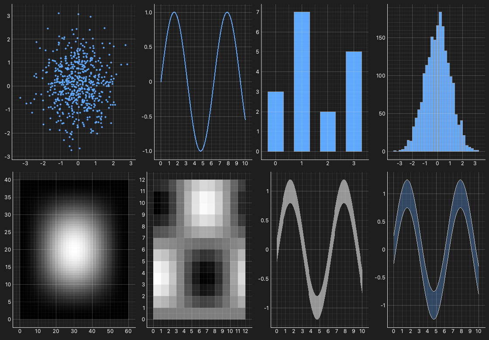
*The element vocabulary in one `Layout` grid ([`examples/08_gallery.py`](examples/08_gallery.py))*

**Axes & legends** — first-class, capability-gated, honest:

```python
qv.Overlay([a, b], options=qv.OverlayOptions(
    title="Spectrum",
    x=qv.AxisSpec(scale="log", lim=(1, 1e4)),   # events stay in DATA space (R1)
    y=qv.AxisSpec(tick_format="eng"),           # SI ticks; ".0%", ",d", "%H:%M",
    legend=True, legend_position="right",       # templates: "{:.0f} ms", "${:,.0f}"
    grid=False,
))

# Explicit ticks, minor ticks, rotated labels ([D101]/[D103])
qv.AxisSpec(ticks=[0, 5, 10], tick_labels=["lo", "mid", "hi"],
            minor=True, tick_rotation=45)

# Twin y axes: put a series on the right-hand axis
qv.Overlay(
    [qv.Curve(t, x="t", y="temp"),
     qv.Curve(t, x="t", y="pressure", axis="y2")],
    options=qv.OverlayOptions(y2=qv.AxisSpec(label="Pa", tick_format="eng")),
)

# Calendar time: datetime64 columns just work — calendar ticks on every
# backend, and events/state stay epoch seconds (one data space, R1)
qv.Curve({"t": timestamps_dt64, "v": values}, x="t", y="v")
```

**Live data** — a thread-safe, append-able source; views update in place:

```python
feed = qv.stream({"t": float, "v": float}, window=100_000)   # rolling ring buffer
view = qv.View(qv.Curve(feed, x="t", y="v"))                 # that's all the wiring
feed.append(t=timestamps, v=values)                          # from any thread
```

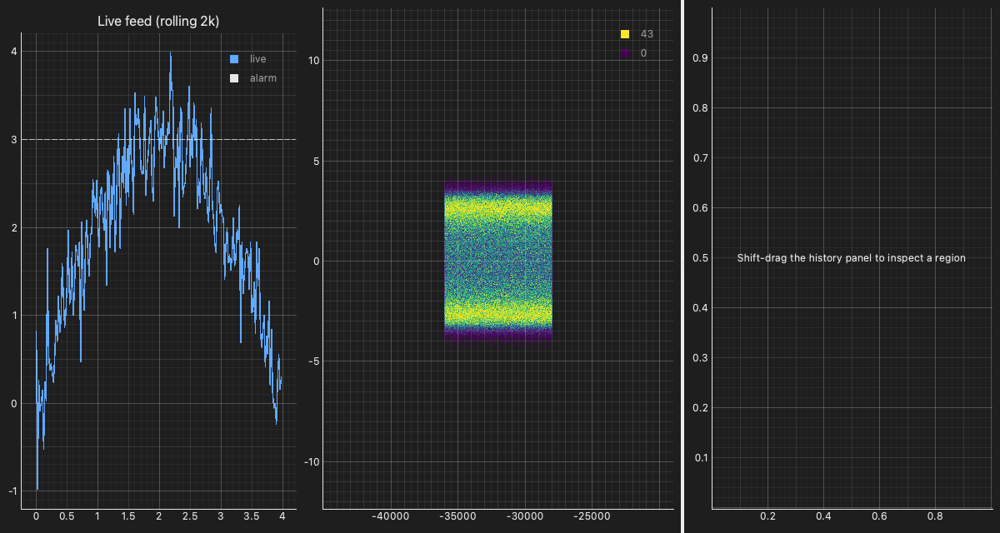
*A live rolling feed, its datashaded 400k-point history, and a brush-driven detail panel ([`examples/34_streaming_telemetry.py`](examples/34_streaming_telemetry.py))*

**Composition** — build a figure tree with two operators:

```python
scatter * curve                 # Overlay: same axes, layered
scatter + histogram             # Layout: side-by-side panels
qv.Layout([a, b, c], kind="tabs")                 # or "grid" | "splitter" | "dock"
qv.Layout([a, b], options=qv.LayoutOptions(cols=2, link_x=True))   # shared X axis
qv.Layout.mosaic("AAB\nCCB", A=a, B=b, C=c,       # spanning panes from an ASCII
    options=qv.LayoutOptions(width_ratios=[1, 1, 0.8],  # plan + track ratios
                             title="Suptitle"))
```

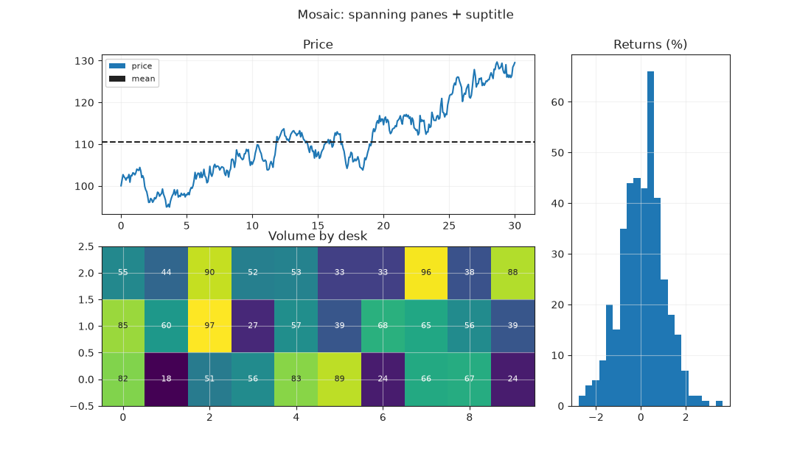
*Spanning panes from an ASCII plan, track ratios, and a figure suptitle
([`examples/36_mosaic_layout.py`](examples/36_mosaic_layout.py))*

**Views & backends** — a `View` is a `QWidget`; choose an engine or let qtviz pick:

```python
view = qv.View(scatter * curve, backend="auto")   # "pyqtgraph" | "matplotlib" | "webengine"
view.set_backend("matplotlib")                     # swap at runtime — keeps zoom + subscriptions
```

**Typed events** — subscribe with `view.on(...)`; payloads are plain dataclasses:

```python
view.on(qv.SelectEvent, lambda e: print(e.indices, e.bounds))  # brush → row indices
view.on(qv.PickEvent,   lambda e: print(e.point_index, e.x, e.y))
view.on(qv.RangeEvent,  lambda e: print(e.x, e.y))             # pan/zoom (throttled)
view.on(qv.HoverEvent,  on_hover)
```

**Theming** — one `Theme` styles every backend:

```python
qv.View(scatter, theme=qv.Theme.dark())
qv.View(scatter, theme=qv.Theme.from_qt_app())     # match the host app's light/dark mode
```

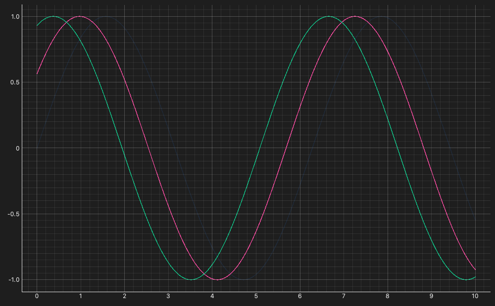
*A registered custom palette on `Theme.dark()` ([`examples/04_theming.py`](examples/04_theming.py))*

---

## Working with data

### Accessors — bind channels however you like

A channel (`x`, `y`, `z`, …) binds to an **accessor**, resolved against your data
at render time:

```python
qv.Scatter(df, x="time", y="temp")                          # a column name
qv.Curve(df,   x="time", y=qv.col("raw") - qv.col("base"))  # an Expression (derived, lazy)
qv.Curve(df,   x="time", y=lambda d: d["raw"].cumsum())     # a callable (arbitrary Python)
qv.Scatter({}, x=np.linspace(0, 1, n), y=values)            # literal arrays
```

A **column name** is the easy default. An **`Expression`** (`qv.col(...)` plus
arithmetic and transforms) is serializable, introspectable, and lazy — the
underlying container does the work, so it pushes down into Dask / Parquet rather
than materializing first. A **callable** is the escape hatch for anything else. A
**literal array** is just the values.

### Color & size encoding — with automatic legends

Bind `color_by` / `size_by` to a column and qtviz maps it to per-point color or
size and adds the matching key automatically — a categorical column becomes a
color legend, a numeric column a continuous ramp plus colorbar:

```python
qv.Scatter(df, x="x", y="y", color_by="category")    # categorical → key legend
qv.Scatter(df, x="x", y="y", color_by="magnitude")   # numeric → ramp + colorbar
qv.Scatter(df, x="x", y="y", size_by="magnitude")    # per-point size
```

It is the same data-to-color rule the Datashader path uses, so a column colors
consistently however it is drawn, on any backend.

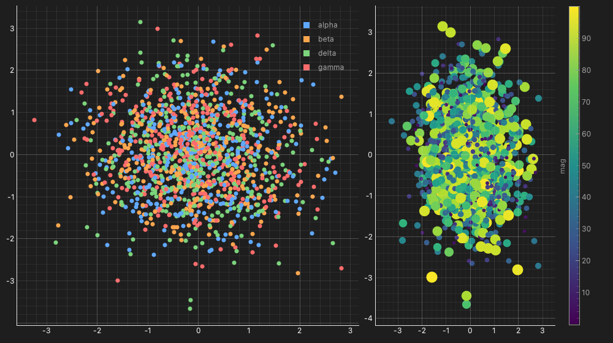
*`color_by` a categorical column (key legend) and a numeric column (ramp + colorbar), with `size_by` ([`examples/12_color_mapping.py`](examples/12_color_mapping.py))*

### Big data — Datashader

Past a few hundred thousand points a scatter overplots into a featureless blob.
Set `scale="datashader"` and qtviz aggregates the points into a
screen-resolution density raster off the GUI thread — and **re-aggregates to the
visible viewport at your widget's pixel size as you pan and zoom**, so the image
sharpens rather than pixelating:

```python
qv.Scatter(big, x="x", y="y", scale="datashader")                  # point density
qv.Curve(series, x="t", y="v", scale="datashader")                 # line density (huge series)
qv.Scatter(big, x="x", y="y", color_by="z",   scale="datashader")  # mean of z per pixel
qv.Scatter(big, x="x", y="y", color_by="cat", scale="datashader")  # per-category blend
qv.Scatter(big, x="x", y="y", scale="auto")                        # rasterize past a threshold
qv.set_raster_threshold(2_000_000)                                 # tune the "auto" cutoff
```

Rasterization is a **backend-agnostic pipeline step**, so every backend draws a
datashaded plot, and it is **out-of-core**: backed by a lazy Dask / xarray / zarr
source, the data is aggregated partition-by-partition and the full table never
lands in memory.

| | |
|---|---|
|  *10M points as a density raster with honest endpoint keys ([`examples/09`](examples/09_datashader.py))* | 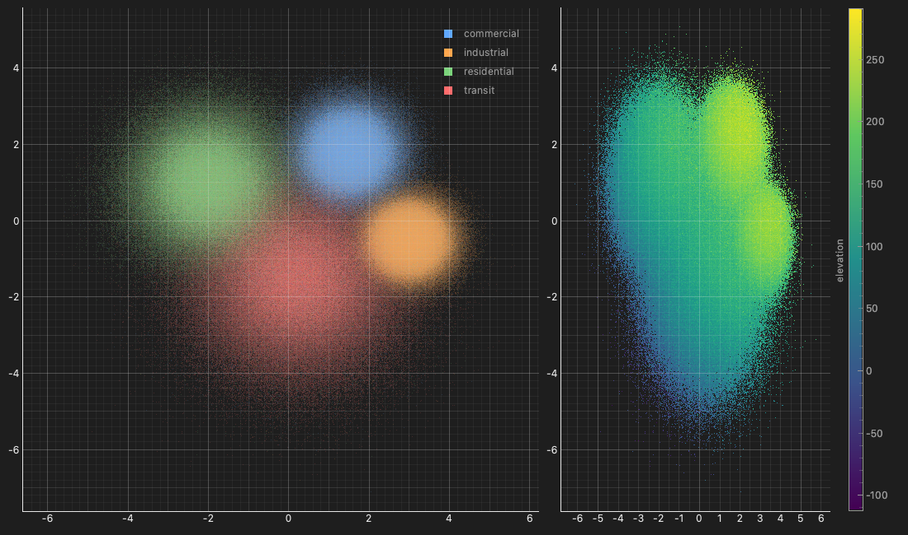 *Category-blend raster with a legend beside an `agg="max"` raster with a colorbar ([`examples/32`](examples/32_datashader_legends.py))* |

---

## Backends

| Backend | Best for | Notes |
|---------|----------|-------|
| **pyqtgraph** | real-time, interactive, large data | default; OpenGL; no extra deps |
| **matplotlib** | figures for print / papers | optional extra; PNG / SVG / PDF export |
| **webengine** | rich interactive web charts, escape hatch | optional extra; Plotly traces in a Qt WebEngine view |

Backends are **registered, never imported by the core**, so adding one touches
only its own directory and the rest of the library is none the wiser.
`View(root, backend=...)` accepts a name, a `Backend`, or `"auto"`; negotiation
resolves an engine per node from backend hints, capabilities, and data size.

| | |
|---|---|
| 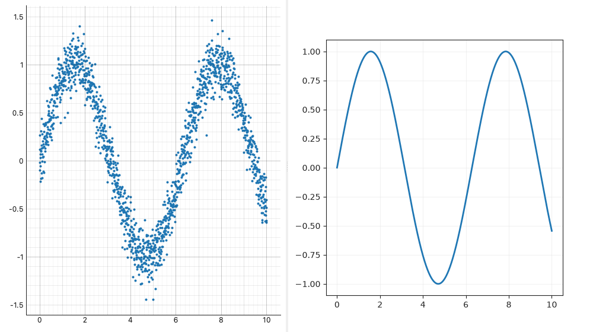 *One `Layout`, two engines: pyqtgraph beside matplotlib, one event stream ([`examples/07`](examples/07_mixed_backends.py))* | 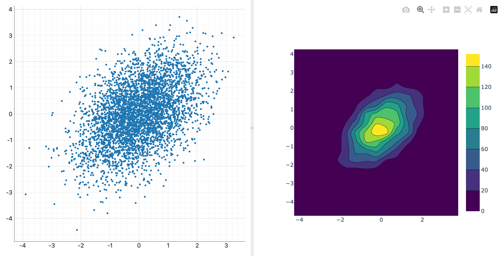 *Native pyqtgraph beside a webengine Plotly pane in one splitter ([`examples/20`](examples/20_mixed_native_web.py))* |

### webengine + `RawFigure` — your existing figures, hosted

The `webengine` backend renders the same Element vocabulary as interactive Plotly
charts inside an embedded `QWebEngineView`, bridging Plotly's interactions back as
the *same* typed qtviz events the native backends emit. And when you have a figure
qtviz doesn't natively model, `RawFigure` hosts it unchanged:

```python
import plotly.graph_objects as go

fig = go.Figure(go.Surface(z=heights))            # a 3-D surface — beyond the 2-D vocabulary
view = qv.View(qv.RawFigure(fig))                 # auto-routes to webengine
view.on(qv.PickEvent, on_pick)                    # Plotly events still arrive as qtviz events
```

`RawFigure` auto-detects Plotly, Bokeh, or HoloViews and hosts each through the
appropriate renderer — so the native HoloViews/Bokeh ecosystems remain one line
away whenever you need them.

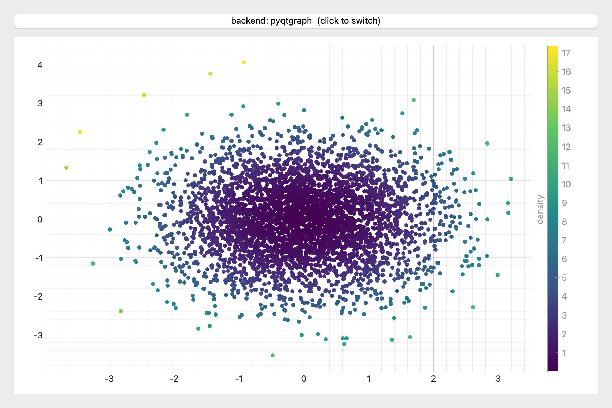
*The same `Scatter` Element as an interactive Plotly chart in a `QWebEngineView` — the button swaps it back to a native backend live ([`examples/13_webengine.py`](examples/13_webengine.py))*

> The `webengine` backend needs the `webengine` extra and a real display (a
> `QWebEngineView` is not usable under headless/offscreen Qt). The native
> pyqtgraph and matplotlib backends have no such constraint.

---

## Examples

Self-contained, runnable scripts live in [`examples/`](examples) — each exposes a
`build()` (returns the widget) and a `main()` (shows a window):

```bash
uv run python examples/01_hello.py
```

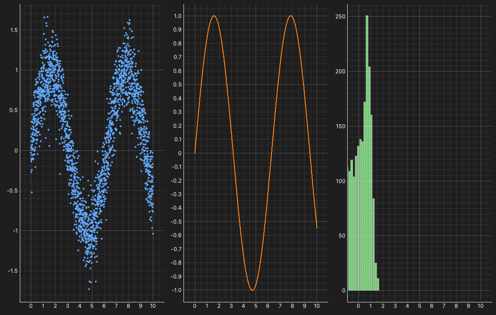
*The linked three-panel dashboard, under sixty lines ([`examples/dashboard_native.py`](examples/dashboard_native.py))*

Every example has a screenshot in the [gallery](docs/gallery.md).

**Native:** `01_hello` · `02_composition` · `03_backends` (switch live) ·
`04_theming` · `05_interaction` · `06_data_binding` · `07_mixed_backends` ·
`08_gallery` (all eight elements) · `09_datashader` (millions of points,
re-aggregated on zoom) · `10_out_of_core` (lazy Dask) · `11_datashader_matplotlib`
· `12_color_mapping` · `25_raster_inspect` (hover a datashaded plot for the count
under the cursor) · `31_axis_labels` · `32_datashader_legends` ·
`33_native_escape_hatch` (the live pyqtgraph item) · `34_streaming_telemetry`
(live feed + datashaded history) · `35_everyday_figures` (the parity vocabulary:
step/area/pie/ECDF/contour/dual-axis/tick formats in one grid) ·
`dashboard_native` (3-panel linked dashboard).

**Reactive & adapter:** `21_reactive_crossfilter` (brush one view → a `Signal`
re-renders another) · `22_from_holoviews` (render a HoloViews tree natively) ·
`23_from_holoviews_dynamicmap` (drive a `DynamicMap` with a Qt control) ·
`24_from_hvplot` (a pandas `.hvplot` one-liner as a native widget).

**Real-world scenarios:** `26_telemetry_monitoring` (rolling baseline, tolerance band,
flagged anomalies, residual panel) · `27_market_analytics` (price + moving averages +
Bollinger band over a linked volume panel) · `28_event_density_map` (2M categorized
events, Datashaded, hover for counts) · `29_climate_field` (an `xarray` 2-D field as an
`Image` map + a 1-D cross-section) · `30_xarray_sensor_lines` (a 3-D `xarray` cube →
all instance lines for one sensor).

**webengine:** `13_webengine` · `14_webengine_overlay` · `15_webengine_elements` ·
`16_webengine_export` (PNG) · `17_webengine_heatmap` · `18_webengine_raw_figure`
(host a Plotly 3-D surface) · `19_webengine_holoviews` · `20_mixed_native_web`.

See [`examples/README.md`](examples/README.md) for the full index.

---

## What works today

| Area | Support |
|------|---------|
| **Backends** | pyqtgraph (native, default) · matplotlib (extra) · webengine / Plotly (extra) — third-party backends via the registry ([writing a backend](docs/backends.md)) |
| **Elements** | Scatter · Curve (step modes, markers, `color_by` segments) · Bars (grouped/stacked, horizontal, `bar_labels`) · Area (stacked bands) · Histogram (one shared binning) · Ecdf · Stem (lollipops) · Image · Heatmap (real aggregation, data coordinates, `cell_labels` with computed contrast) · Mesh (non-uniform cell edges) · Contour (shared levels, filled, core-placed inline labels) · Quiver (vector fields + reference key) · Streamlines (RK4 field lines, spacing mask) · Pie (donuts) · ErrorBars (x/y/both, `lo_limit`/`hi_limit` arrows) · Spread · BoxPlot · Violin · HLine/VLine/Span/Text/Arrow/Rect/Ellipse/Polygon/RefLine (annotations & reference chrome) · `RawFigure` (passthrough) |
| **Composition** | Overlay (`*`) · Layout (`+`): grid / splitter / tabs / dock · `Layout.mosaic("AAB\nCCB", …)` spanning panes · `width_ratios`/`height_ratios` · figure suptitle · mixed-backend panes |
| **Data binding** | accessors: column name · `Expression` (`col`, arithmetic, transforms) · callable · literal array |
| **Encoding** | `color_by` (categorical key · continuous ramp) · `size_by` · **automatic legend / colorbar** |
| **Data inputs** | dict · NumPy · pandas · Arrow (eager) · **Dask · xarray · zarr** (out-of-core, off-thread) · `qv.tabular()` / `qv.gridded()` shape overrides |
| **Big data** | **Datashader** — `Scatter` / `Curve` with `scale="datashader" \| "auto"`: density · `color_by` mean · categorical blend; out-of-core, off-thread, re-aggregating to the viewport on zoom; **hover a raster for the aggregated value** (`HoverEvent.value`) |
| **Axes & legends** | `AxisSpec`: log/symlog + **calendar-time** scales (data-space events everywhere, R1; datetime64 auto-detected, epoch-seconds canonical) · tick formatting (format specs, SI, strftime, one-field templates) · explicit `ticks`/`tick_labels` · minor ticks · label rotation · **twin y axes** (`axis="y2"`) · limits · invert · aspect · grid toggle · multi-series legends (`label` + aggregation, quiver reference key) · gradient colorbars · `color_norm="log"` with honest endpoint keys |
| **Raster norms** | `norm="linear" \| "log" \| "power" \| "symlog" \| "boundary"` + `vmin`/`vmax`/`gamma`/`linthresh`/`levels` on Image/Heatmap/Mesh — normalized once in core (bit-identical grids per backend) with [D48]-honest colorbars (mpl denormalized/discrete ticks · pg endpoints key · Plotly hidden non-linear scale) |
| **Interaction** | pan / zoom · brush-select — **including through datashaded views** (row indices when eager, bounds-predicate when lazy) · pick · hover · tap · linked axes · typed events via `View.on` · `View(toolbar=True)` native toolbar + rubber-band brush on matplotlib |
| **Live / streaming** | `qv.stream(...)`: thread-safe appends, rolling windows, in-place item updates on pyqtgraph (one refresh per tick), honest fallbacks elsewhere |
| **HoloViews / hvplot** | `from_holoviews(obj)` translates a HoloViews tree to native Elements (8 elements + containers; `RawFigure` fallback) · `DynamicMap` → `Signal[Node]` (kdim-driven re-render) · `from_hvplot(df, kind, …)` one-liner |
| **Reactive** | `signal` / `derived` / `effect` / `batch` (S-style auto-tracking) · `View(Signal[Node])` re-renders on change · crossfilter / linked brushing |
| **Theming** | `Theme.light()` / `dark()` / `from_qt_app()` · `Color` · `Palette` |
| **Lifecycle** | runtime backend switching · auto backend selection · live theme/data updates · async render for lazy data |
| **Big arrays** | zarr / dask / xarray grids render at **screen cost** — decimated reads, viewport regrid on zoom (the image sharpens), window-partial chunk I/O |
| **Export** | PNG (pyqtgraph) · PNG / SVG / PDF (matplotlib, `dpi`/`transparent`) · PNG (webengine) · **one PNG from a mixed-backend layout** |

---

## Roadmap

**1.0 is the stability release** — the staged post-0.1 program (hardening →
first-class axes/legends → vocabulary/annotation/export → the array data core →
live & linked) is complete, and the public surface is frozen under a documented
policy ([docs/stability.md](docs/stability.md)); the suite itself pins the API,
the honor-or-warn contract, and the benchmark ceilings.

**The parity program shipped on top** (additive, [D83]–[D95],
[`design/parity-program.md`](design/parity-program.md)): the everyday figures of
the popular libraries — step/area/pie/ECDF/contour, horizontal bars, twin y
axes, tick formatting, calendar-time axes — plus one shared statistics core so
every backend draws the same numbers, and `View(toolbar=True)`.

Post-1.0 exploration (unscheduled): qtviz Studio — a desktop app built on the
library. The living plan and full decision log ([D1]–[D95]) are in
[`design/`](design), starting from [`design/improvement-plan.md`](design/improvement-plan.md).

## Architecture

```
Element (pure data)
    │  negotiation picks a Backend from hints + capabilities + data size
    ▼
resolve pipeline  ── turns channel accessors into role-keyed arrays
    │                (off the GUI thread for lazy / datashaded data)
    ▼
Backend renderers ── build native primitives (pyqtgraph items, mpl artists,
    │                Plotly traces)
    ▼
RenderHandle ── owns the QWidget and a typed EventBus; survives backend swaps
```

Both **backends and data adapters are registered, never imported by the core**, so
every new engine or container type is purely additive. The design documents —
specification, development plan, milestone notes, and the full decision log — live
in [`design/`](design/).

---

## Migrating from `qtwebplot`

qtviz began as `qtwebplot`; the Qt↔JS bridge lives under
`qtviz.backends.webengine`. The compatibility shim that redirected
`import qtwebplot` (deprecated since 0.1) was **removed in 1.0** — update any
remaining imports to `qtviz.backends.webengine` (or the public `qtviz` API).
See [docs/stability.md](docs/stability.md) for the deprecation policy.

---

## Contributing

The repo is private by design. The full quality gate (what a release must pass)
is documented in [`RELEASING.md`](RELEASING.md):

```bash
uv run pytest            # Qt runs offscreen by default
uv run ruff check src tests examples
uv run mypy src/qtviz
uv run pytest -q --cov   # floor: 88%
```

---

## License

[MIT](LICENSE)
