# Gallery

Every screenshot on this page is captured from a self-contained, runnable
script in [`examples/`](https://github.com/jawjay/qtviz/tree/main/examples) —
each exposes a `build()` (returns the widget) and a `main()` (shows a window):

```bash
uv run python examples/01_hello.py
```

## Showcase

Larger scenarios that combine several features around a realistic dataset.

### Sensor telemetry

A rolling baseline, a 3σ tolerance `Spread`, flagged-anomaly `Scatter`, and an
X-linked residual panel derived with an `Expression` —
[`26_telemetry_monitoring.py`](https://github.com/jawjay/qtviz/blob/main/examples/26_telemetry_monitoring.py)

[](images/examples/26_telemetry_monitoring.png)

### Market analytics

Price `Curve` + 20/50-day moving averages + a Bollinger `Spread`, over an
X-linked volume `Bars` panel —
[`27_market_analytics.py`](https://github.com/jawjay/qtviz/blob/main/examples/27_market_analytics.py)

[](images/examples/27_market_analytics.png)

### Streaming telemetry

A live rolling feed (`qv.stream`), its 400k-point history datashaded, and a
brush-driven detail panel wired through a `Signal` —
[`34_streaming_telemetry.py`](https://github.com/jawjay/qtviz/blob/main/examples/34_streaming_telemetry.py)

[](images/examples/34_streaming_telemetry.png)

### The everyday figures

Step curve, stacked `Area`, horizontal `Bars`, `Pie` donut, `Ecdf`, filled
`Contour`, SI ticks, a dual-axis pair, `Quiver` with a reference key, a
boundary-level `Mesh`, `Stem`, and an annotated `Heatmap` — one grid, under the
native toolbar —
[`35_everyday_figures.py`](https://github.com/jawjay/qtviz/blob/main/examples/35_everyday_figures.py)

[](images/examples/35_everyday_figures.png)

### Linked dashboard

Three panels, shared X, brushing, dark theme — under sixty lines —
[`dashboard_native.py`](https://github.com/jawjay/qtviz/blob/main/examples/dashboard_native.py)

[](images/examples/dashboard_native.png)

### Big-data density map

2M categorized events datashaded into a categorical density map; hover reports
the count under the cursor —
[`28_event_density_map.py`](https://github.com/jawjay/qtviz/blob/main/examples/28_event_density_map.py)

[](images/examples/28_event_density_map.png)

### Gridded science

An `xarray` 2-D field as an `Image` map plus a 1-D cross-section `Curve`, and a
3-D cube overlaying 250 instance lines with a mean envelope —
[`29_climate_field.py`](https://github.com/jawjay/qtviz/blob/main/examples/29_climate_field.py) ·
[`30_xarray_sensor_lines.py`](https://github.com/jawjay/qtviz/blob/main/examples/30_xarray_sensor_lines.py)

[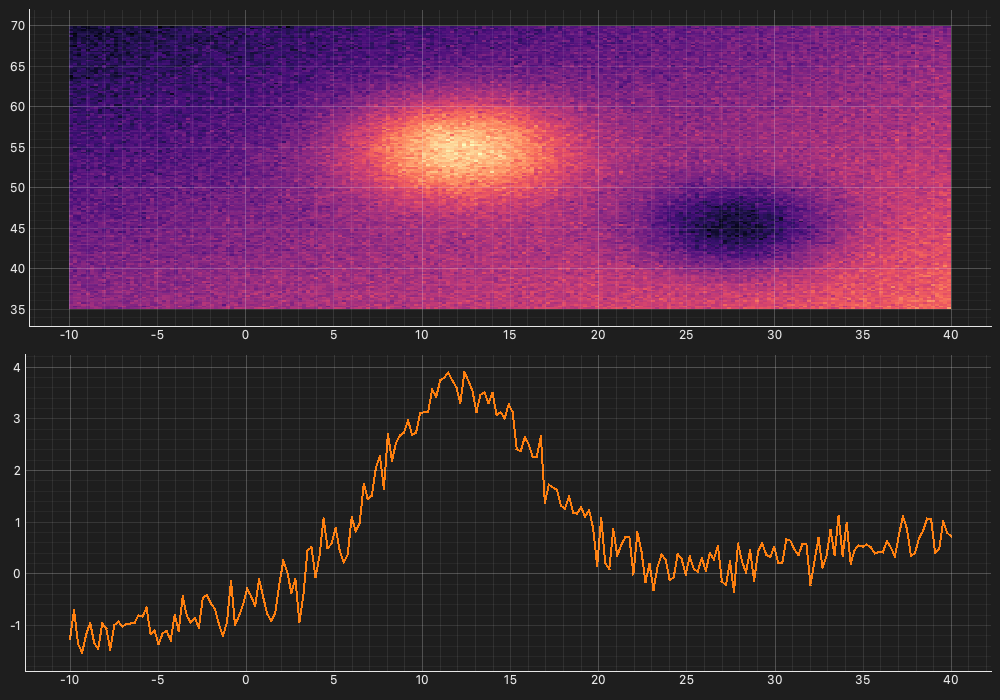](images/examples/29_climate_field.png)

[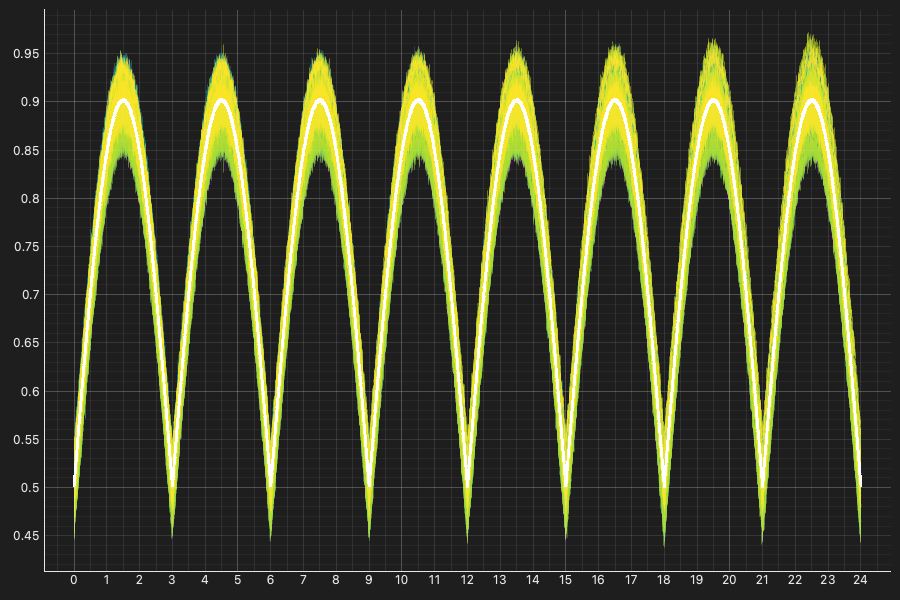](images/examples/30_xarray_sensor_lines.png)

### Mosaic layout

`Layout.mosaic("AAB\nCCB", …)` — spanning panes from an ASCII plan, track
ratios, and a figure suptitle —
[`36_mosaic_layout.py`](https://github.com/jawjay/qtviz/blob/main/examples/36_mosaic_layout.py)

[](images/examples/36_mosaic_layout.png)

Named panes — the mosaic's list form names every subplot (`"price"`,
`"volume"`, `"depth"`), `link_x="col"` keeps a column time-aligned, and the
same names address the live render: `view.pane("price").set_range(x=…)` zooms
programmatically (the linked pane follows), `pane.export(...)` writes one
pane, `view.on(..., pane="price")` scopes events —
[`37_named_panes.py`](https://github.com/jawjay/qtviz/blob/main/examples/37_named_panes.py)

[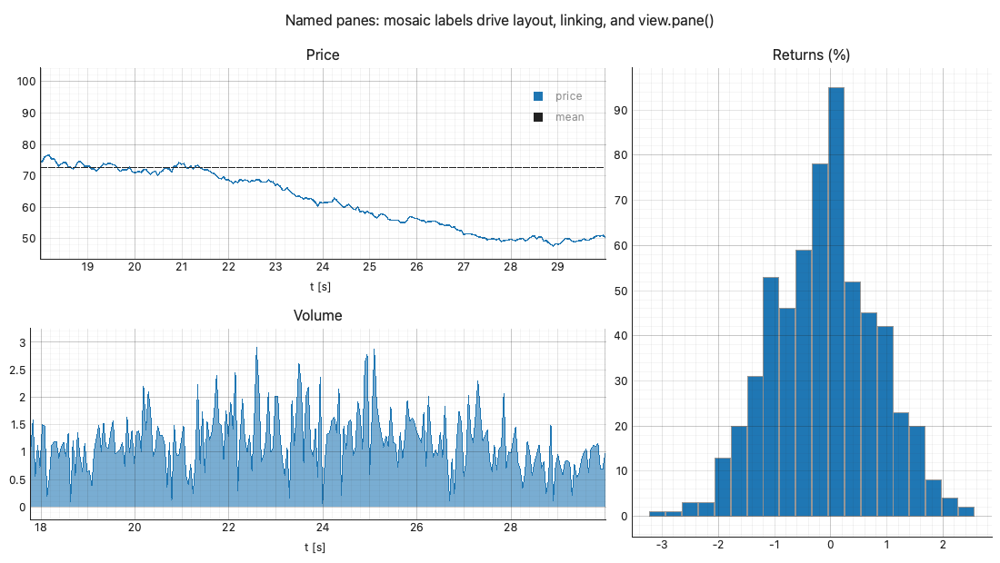](images/examples/37_named_panes.png)

Inset axes — `overview * qv.Inset(zoom, rect=…, label="zoom",
indicate=True)`: a child surface floating on its parent with the zoom
window marked on the parent; the labeled inset is a pane
(`view.pane("zoom").set_range(…)`, pane-scoped events, per-pane export,
state that survives backend switches) —
[`38_inset_zoom.py`](https://github.com/jawjay/qtviz/blob/main/examples/38_inset_zoom.py)

[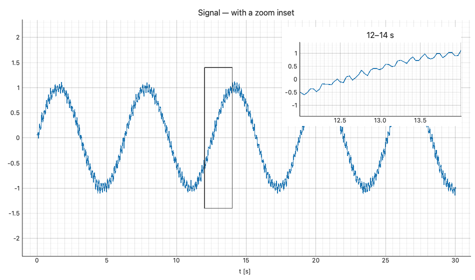](images/examples/38_inset_zoom.png)

## Getting started

<div class="grid cards" markdown>

-   [](images/examples/01_hello.png)

    **The smallest program** — a scatter in a `View`, six lines.

    [`01_hello.py`](https://github.com/jawjay/qtviz/blob/main/examples/01_hello.py)

-   [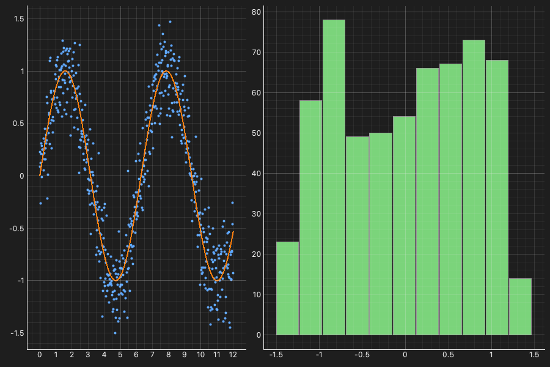](images/examples/02_composition.png)

    **Composition** — overlay with `*`, lay out with `+`.

    [`02_composition.py`](https://github.com/jawjay/qtviz/blob/main/examples/02_composition.py)

-   [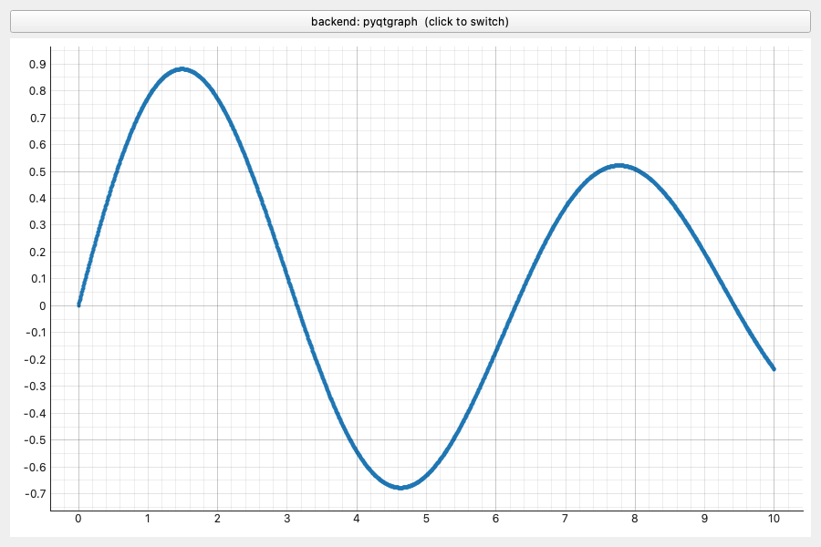](images/examples/03_backends.png)

    **Switch engines at runtime** — the same plot via pyqtgraph or matplotlib.

    [`03_backends.py`](https://github.com/jawjay/qtviz/blob/main/examples/03_backends.py)

-   [](images/examples/04_theming.png)

    **Themes & palettes** — light/dark, colors, a registered custom palette.

    [`04_theming.py`](https://github.com/jawjay/qtviz/blob/main/examples/04_theming.py)

</div>

## Core concepts

<div class="grid cards" markdown>

-   [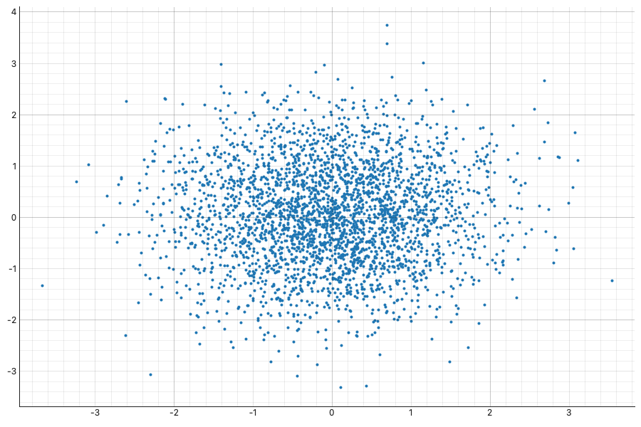](images/examples/05_interaction.png)

    **Typed events** — brush-select, pick, range.

    [`05_interaction.py`](https://github.com/jawjay/qtviz/blob/main/examples/05_interaction.py)

-   [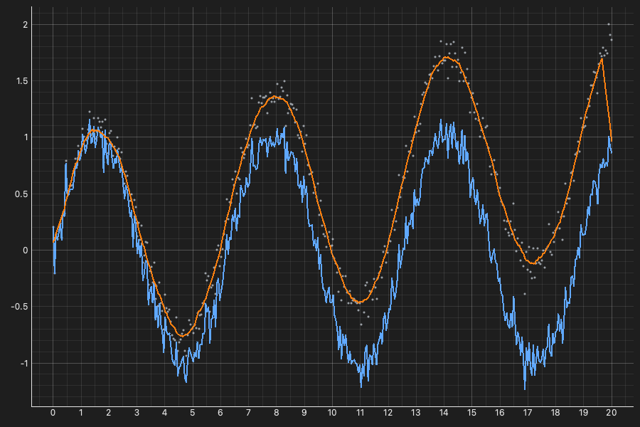](images/examples/06_data_binding.png)

    **Accessors** — bind channels to names, `Expression`s, callables, arrays.

    [`06_data_binding.py`](https://github.com/jawjay/qtviz/blob/main/examples/06_data_binding.py)

-   [](images/examples/12_color_mapping.png)

    **Color & size encoding** — `color_by` / `size_by` with automatic legends.

    [`12_color_mapping.py`](https://github.com/jawjay/qtviz/blob/main/examples/12_color_mapping.py)

-   [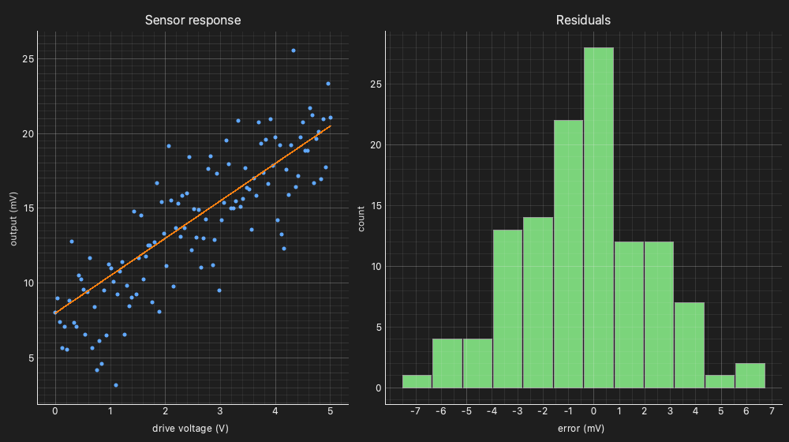](images/examples/31_axis_labels.png)

    **Axis labels & titles** — `.opts(title=…, x=…, y=…)` on any surface.

    [`31_axis_labels.py`](https://github.com/jawjay/qtviz/blob/main/examples/31_axis_labels.py)

-   [](images/examples/08_gallery.png)

    **The element vocabulary** — the core element types in one grid.

    [`08_gallery.py`](https://github.com/jawjay/qtviz/blob/main/examples/08_gallery.py)

-   [](images/examples/07_mixed_backends.png)

    **Two engines, one window** — pyqtgraph beside matplotlib, one event stream.

    [`07_mixed_backends.py`](https://github.com/jawjay/qtviz/blob/main/examples/07_mixed_backends.py)

-   [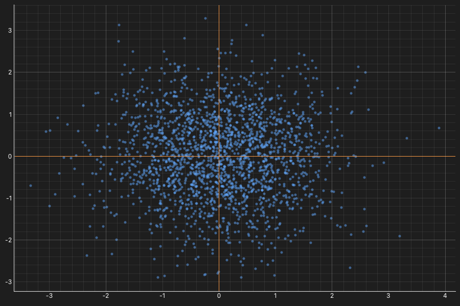](images/examples/33_native_escape_hatch.png)

    **The native escape hatch** — `view.native(id)` returns the live
    pyqtgraph item.

    [`33_native_escape_hatch.py`](https://github.com/jawjay/qtviz/blob/main/examples/33_native_escape_hatch.py)

</div>

## Big data — Datashader

<div class="grid cards" markdown>

-   [](images/examples/09_datashader.png)

    **Millions of points** — a density raster that re-aggregates to the
    viewport on zoom.

    [`09_datashader.py`](https://github.com/jawjay/qtviz/blob/main/examples/09_datashader.py)

-   [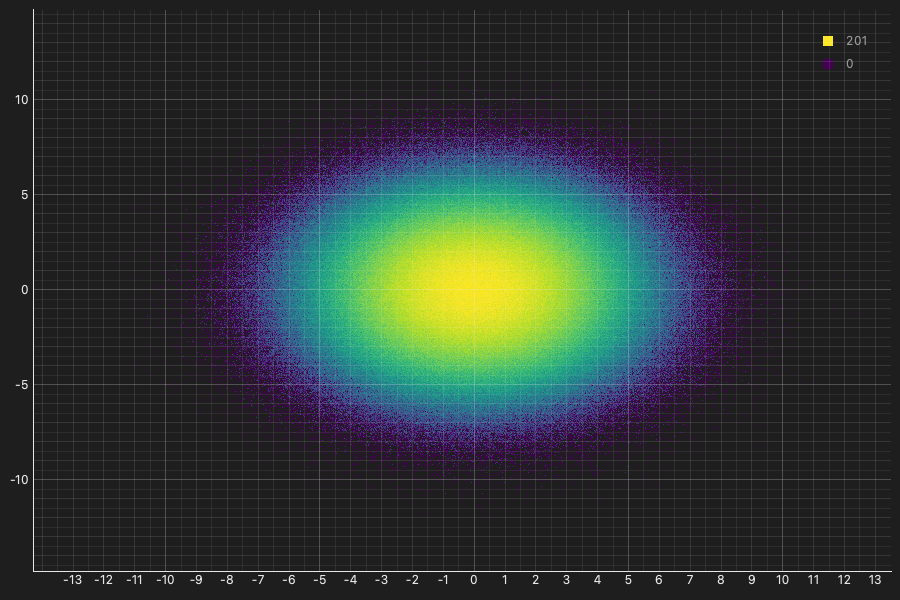](images/examples/10_out_of_core.png)

    **Out-of-core** — a lazy Dask DataFrame, never fully materialized.

    [`10_out_of_core.py`](https://github.com/jawjay/qtviz/blob/main/examples/10_out_of_core.py)

-   [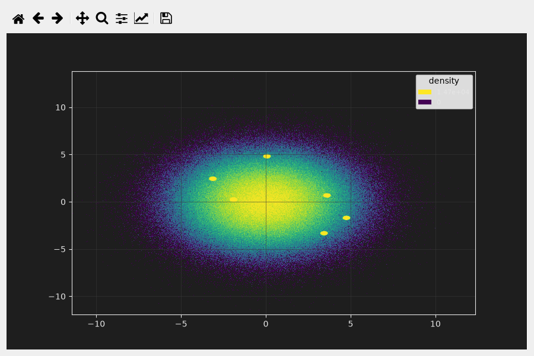](images/examples/11_datashader_matplotlib.png)

    **Backend-agnostic rasters** — the same datashaded scatter on matplotlib.

    [`11_datashader_matplotlib.py`](https://github.com/jawjay/qtviz/blob/main/examples/11_datashader_matplotlib.py)

-   [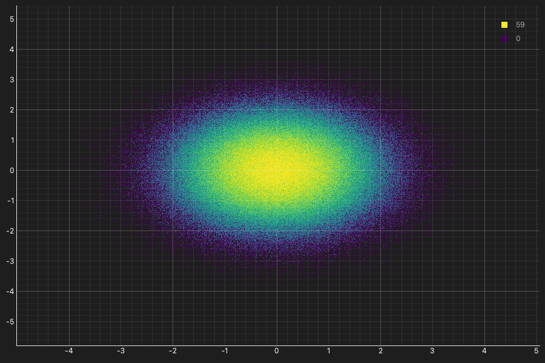](images/examples/25_raster_inspect.png)

    **Hover a raster** — `HoverEvent.value` reports the count under the cursor.

    [`25_raster_inspect.py`](https://github.com/jawjay/qtviz/blob/main/examples/25_raster_inspect.py)

-   [](images/examples/32_datashader_legends.png)

    **Raster legends & aggregation** — a themed category blend with a legend,
    an `agg="max"` raster with a colorbar.

    [`32_datashader_legends.py`](https://github.com/jawjay/qtviz/blob/main/examples/32_datashader_legends.py)

</div>

## Reactive & adapters

<div class="grid cards" markdown>

-   [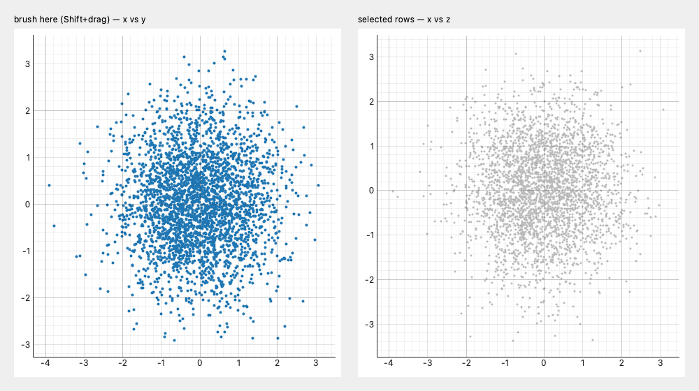](images/examples/21_reactive_crossfilter.png)

    **Reactive crossfilter** — brush one view; a `Signal` re-renders another.

    [`21_reactive_crossfilter.py`](https://github.com/jawjay/qtviz/blob/main/examples/21_reactive_crossfilter.py)

-   [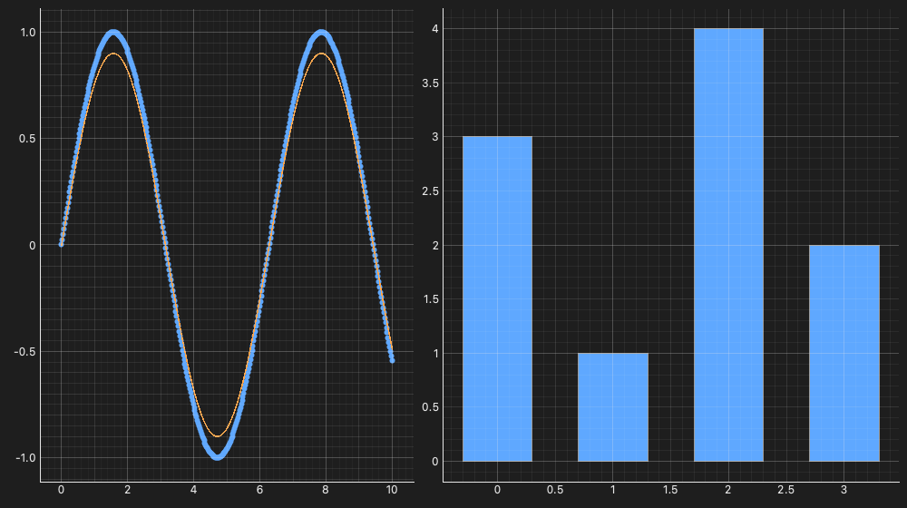](images/examples/22_from_holoviews.png)

    **HoloViews, natively** — a `scatter * curve + bars` tree, no browser.

    [`22_from_holoviews.py`](https://github.com/jawjay/qtviz/blob/main/examples/22_from_holoviews.py)

-   [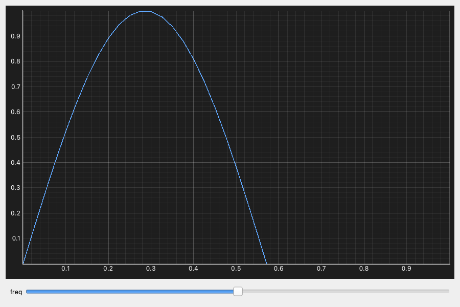](images/examples/23_from_holoviews_dynamicmap.png)

    **DynamicMap** — drive a kdim with a Qt slider; a `Signal[Node]`
    re-renders.

    [`23_from_holoviews_dynamicmap.py`](https://github.com/jawjay/qtviz/blob/main/examples/23_from_holoviews_dynamicmap.py)

-   [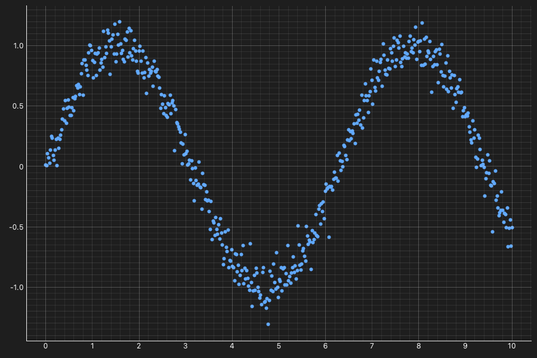](images/examples/24_from_hvplot.png)

    **hvplot one-liner** — `df.hvplot(kind="scatter")` as a native Qt widget.

    [`24_from_hvplot.py`](https://github.com/jawjay/qtviz/blob/main/examples/24_from_hvplot.py)

</div>

## WebEngine

The same elements rendered as interactive Plotly in a `QWebEngineView`, plus
`RawFigure` passthrough for existing Plotly / Bokeh / HoloViews figures.
These need the `webengine` extra and a real display.

<div class="grid cards" markdown>

-   [](images/examples/13_webengine.png)

    **Plotly in a Qt window** — typed events bridge back; swap to a native
    backend live.

    [`13_webengine.py`](https://github.com/jawjay/qtviz/blob/main/examples/13_webengine.py)

-   [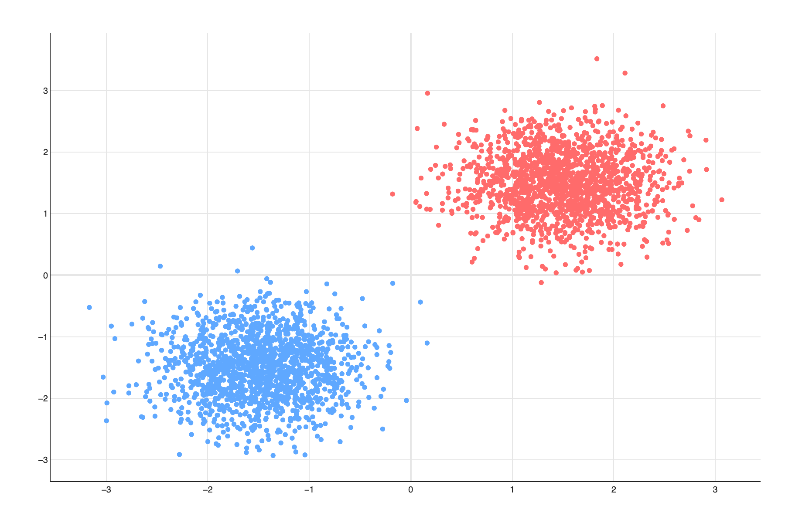](images/examples/14_webengine_overlay.png)

    **Multi-trace figures** — an `Overlay` as Plotly traces; picks carry the
    series id.

    [`14_webengine_overlay.py`](https://github.com/jawjay/qtviz/blob/main/examples/14_webengine_overlay.py)

-   [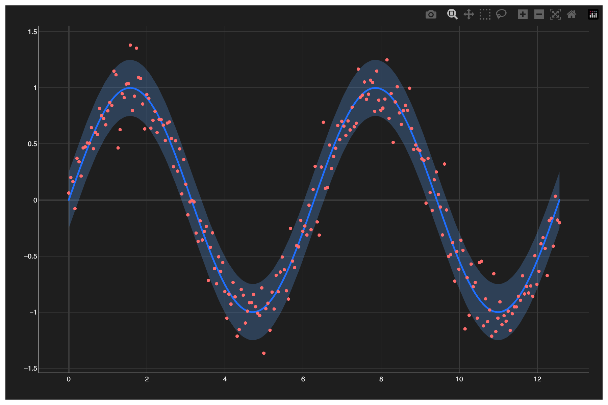](images/examples/15_webengine_elements.png)

    **Mixed elements, one figure** — Spread + Curve + Scatter together.

    [`15_webengine_elements.py`](https://github.com/jawjay/qtviz/blob/main/examples/15_webengine_elements.py)

-   [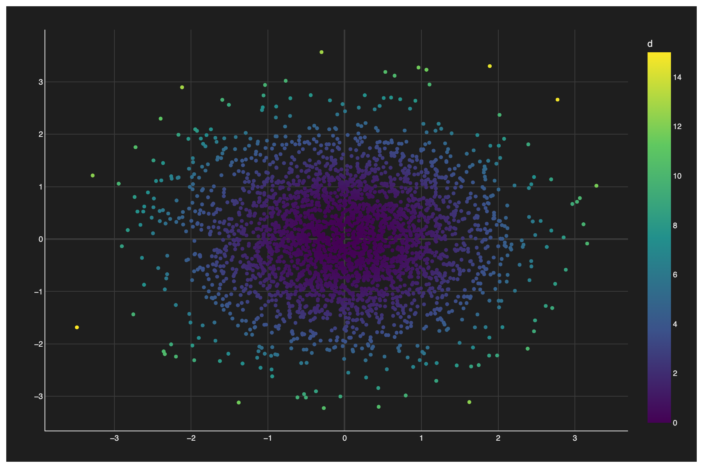](images/examples/16_webengine_export.png)

    **PNG export** — `view.handle.export("png", path)`.

    [`16_webengine_export.py`](https://github.com/jawjay/qtviz/blob/main/examples/16_webengine_export.py)

-   [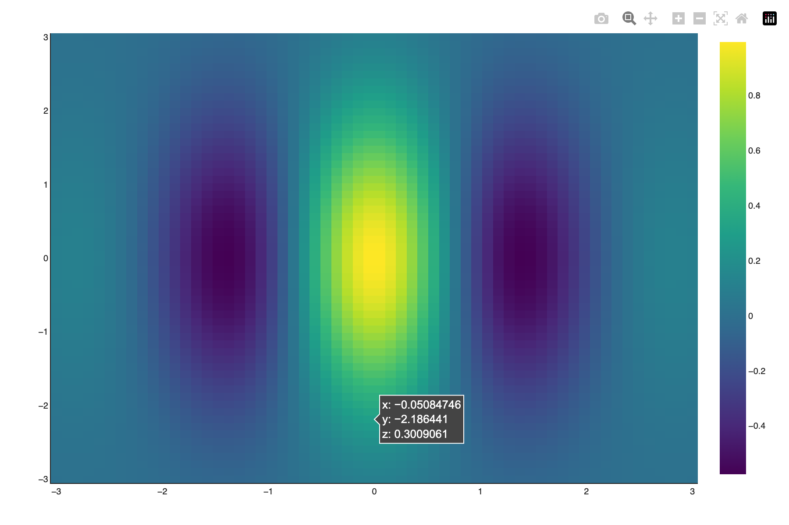](images/examples/17_webengine_heatmap.png)

    **Plotly heatmap** — a tabular `Heatmap` with a Viridis colorscale.

    [`17_webengine_heatmap.py`](https://github.com/jawjay/qtviz/blob/main/examples/17_webengine_heatmap.py)

-   [](images/examples/18_webengine_raw_figure.png)

    **RawFigure passthrough** — host a Plotly 3-D surface; events still
    bridge back.

    [`18_webengine_raw_figure.py`](https://github.com/jawjay/qtviz/blob/main/examples/18_webengine_raw_figure.py)

-   [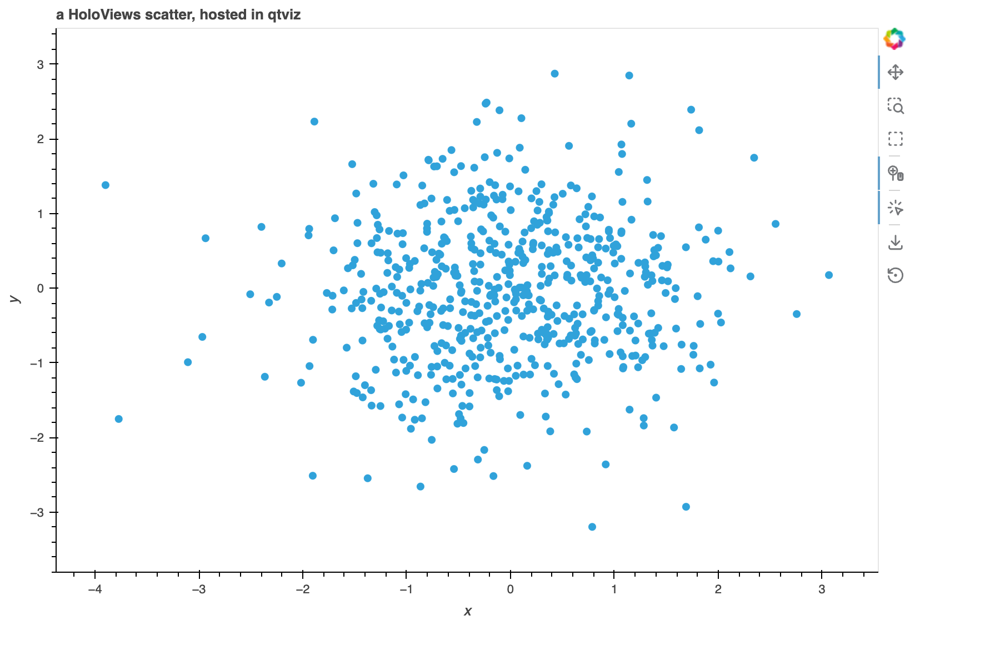](images/examples/19_webengine_holoviews.png)

    **HoloViews via Bokeh** — tap / box-select / range as typed qtviz events.

    [`19_webengine_holoviews.py`](https://github.com/jawjay/qtviz/blob/main/examples/19_webengine_holoviews.py)

-   [](images/examples/20_mixed_native_web.png)

    **Native beside web** — one window, one event stream, two engines.

    [`20_mixed_native_web.py`](https://github.com/jawjay/qtviz/blob/main/examples/20_mixed_native_web.py)

</div>

---

The full index with per-example notes and required extras lives in
[`examples/README.md`](https://github.com/jawjay/qtviz/blob/main/examples/README.md);
regenerate every screenshot with `uv run python tools/capture_screenshots.py`.
