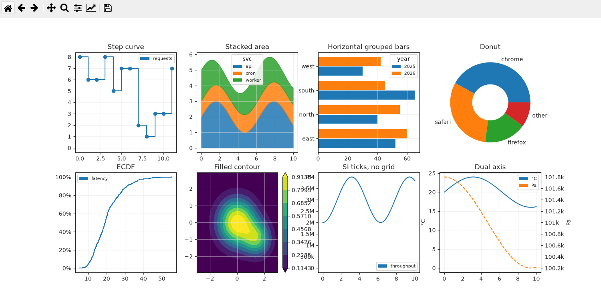
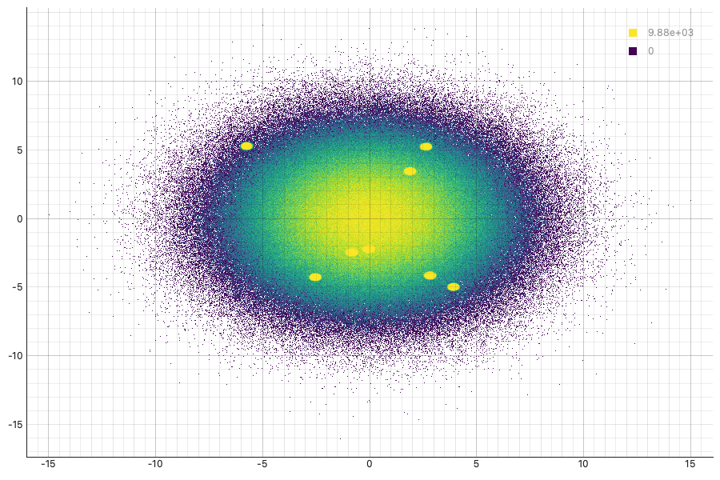

# Quickstart

A tour of the whole library in a handful of snippets. Five concepts — `Element`,
composition (`*` / `+`), `View`, `Theme`, typed events — cover everything.

## Elements

Nineteen immutable plot types, each pure data:

```python
qv.Scatter(table, x="x", y="y", color_by="category")
qv.Curve(table,   x="t", y="v", step="post", marker="circle")
qv.Bars(table,    x="category", y="count", group="region", orient="h")
qv.Area(table,    x="t", y="load", group="service", mode="stacked")
qv.Histogram(table, column="value", bins="fd")
qv.Ecdf(table, column="latency")
qv.Heatmap(table, x="x", y="y", z="z")
qv.Image(array2d, bounds=(0, 0, 10, 10))
qv.Contour(field2d, bounds=(0, 0, 10, 10), levels=8, filled=True)
qv.Pie(table, values="share", labels="browser", hole=0.4)
qv.ErrorBars(table, x="x", y="y", err="sigma")
qv.Spread(table, x="t", y_lo="lo", y_hi="hi")   # filled confidence band
qv.BoxPlot(table, column="score", by="cohort")
qv.Violin(table,  column="score", by="cohort")
qv.HLine(4.5, label="alarm") ; qv.VLine(0.0) ; qv.Span(2, 4) ; qv.Text(5, 2, "peak")
```



## Axes

Per-axis `AxisSpec` on the shared surface; events stay in data space (R1):

```python
qv.Overlay([a, b], options=qv.OverlayOptions(
    title="Spectrum",
    x=qv.AxisSpec(scale="log", lim=(1, 1e4)),
    y=qv.AxisSpec(tick_format="eng"),        # SI ticks; also ".0%", ",d", "%H:%M"
    y2=qv.AxisSpec(label="Pa"),              # twin right axis — put a series on it
    grid=False,                              # with Curve(..., axis="y2")
))

qv.Curve({"t": dt64_stamps, "v": values}, x="t", y="v")   # datetime64 → calendar
                                                          # ticks on every backend
```

## Composition

Build a figure tree with two operators:

```python
scatter * curve                 # Overlay: same axes, layered
scatter + histogram             # Layout: side-by-side panels
qv.Layout([a, b, c], kind="tabs")                                  # grid | splitter | tabs | dock
qv.Layout([a, b], options=qv.LayoutOptions(cols=2, link_x=True))   # shared X axis
```

## Views & backends

A `View` is a `QWidget`; choose an engine or let qtviz pick:

```python
view = qv.View(scatter * curve, backend="auto")   # "pyqtgraph" | "matplotlib" | "webengine"
view.set_backend("matplotlib")                     # swap at runtime — keeps zoom + subscriptions
```

## Typed events

```python
view.on(qv.SelectEvent, lambda e: print(e.indices, e.bounds))   # brush → row indices
view.on(qv.PickEvent,   lambda e: print(e.point_index, e.x, e.y))
view.on(qv.HoverEvent,  lambda e: print(e.x, e.y, e.value))     # value set on datashaded rasters
```

## Data binding

A channel binds to a column name, a lazy `Expression`, a callable, or a literal array:

```python
qv.Scatter(df, x="time", y="temp")                          # a column name
qv.Curve(df,   x="time", y=qv.col("raw") - qv.col("base"))  # an Expression (derived, lazy)
qv.Curve(df,   x="time", y=lambda d: d["raw"].cumsum())     # a callable
qv.Scatter({}, x=np.linspace(0, 1, n), y=values)            # literal arrays
```

## Big data — Datashader

```python
qv.Scatter(big, x="x", y="y", scale="datashader")   # density raster, re-aggregates on zoom
qv.Scatter(big, x="x", y="y", scale="auto")         # rasterize past a threshold
view.on(qv.HoverEvent, lambda e: print(e.value))    # count/mean under the cursor
```



## Reactive

```python
sel = qv.signal([])
filtered = qv.derived(lambda: subset(table, sel.get()))
view = qv.View(filtered)            # re-renders whenever `sel` changes
src.on(qv.SelectEvent, lambda e: sel.set(e.indices))
```

## HoloViews / hvplot

```python
qv.from_holoviews(hv.Scatter(df, "x", "y") * hv.Curve(df, "x", "y"))   # native translation
qv.from_hvplot(df, "scatter", x="x", y="y")                            # pandas .hvplot one-liner
```

See the [Gallery](gallery.md) for runnable end-to-end scripts.
